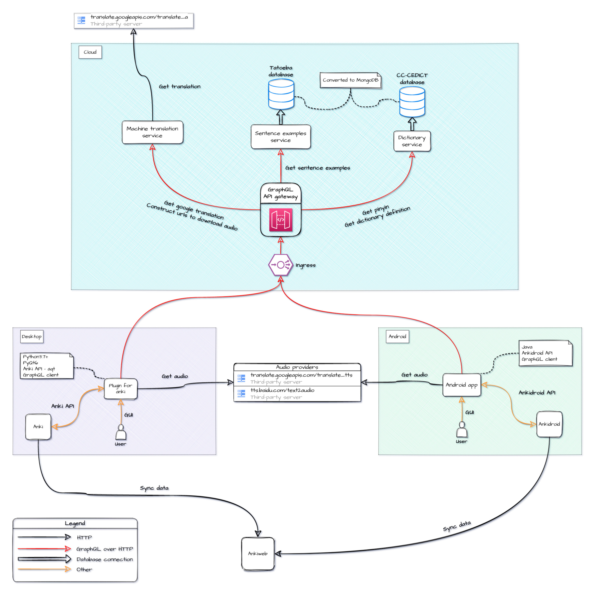

<!-- https://github.com/othneildrew/Best-README-Template -->
<!-- Improved compatibility of back to top link: See: https://github.com/othneildrew/Best-README-Template/pull/73 -->

<a name="readme-top"></a>

<!--
*** Thanks for checking out the Best-README-Template. If you have a suggestion
*** that would make this better, please fork the repo and create a pull request
*** or simply open an issue with the tag "enhancement".
*** Don't forget to give the project a star!
*** Thanks again! Now go create something AMAZING! :D
-->

<!-- PROJECT SHIELDS -->
<!--
*** I'm using markdown "reference style" links for readability.
*** Reference links are enclosed in brackets [ ] instead of parentheses ( ).
*** See the bottom of this document for the declaration of the reference variables
*** for contributors-url, forks-url, etc. This is an optional, concise syntax you may use.
*** https://www.markdownguide.org/basic-syntax/#reference-style-links
-->

[![Contributors][contributors-shield]][contributors-url]
[![Forks][forks-shield]][forks-url]
[![Stargazers][stars-shield]][stars-url]
[![Issues][issues-shield]][issues-url]
[![AGPL-3.0 License][license-shield]][license-url]
[![Build][build-shield]][build-url]
[![Coverage][coverage-shield]][coverage-url]
[![Tests][tests-shield]][tests-url]

<!-- PROJECT LOGO -->
<br />
<div align="center">
  <a href="https://github.com/jingyangzhenren/app-web-anki-plugin">
    
  </a>

<h3 align="center">project_title</h3>

  <p align="center">
    project_description
    <br />
    <a href="https://github.com/jingyangzhenren/app-web-anki-plugin"><strong>Explore the docs »</strong></a>
    <br />
    <br />
    <a href="https://github.com/jingyangzhenren/app-web-anki-plugin">View Demo</a>
    ·
    <a href="https://github.com/jingyangzhenren/app-web-anki-plugin/issues">Report Bug</a>
    ·
    <a href="https://github.com/jingyangzhenren/app-web-anki-plugin/issues">Request Feature</a>
  </p>
</div>

<!-- TABLE OF CONTENTS -->
<details>
  <summary>Table of Contents</summary>
  <ol>
    <li>
      <a href="#about-the-project">About The Project</a>
      <ul>
        <li><a href="#built-with">Built With</a></li>
      </ul>
    </li>
    <li>
      <a href="#getting-started">Getting Started</a>
      <ul>
        <li><a href="#prerequisites">Prerequisites</a></li>
        <li><a href="#installation">Installation</a></li>
      </ul>
    </li>
    <li><a href="#usage">Usage</a></li>
    <li><a href="#roadmap">Roadmap</a></li>
    <li><a href="#contributing">Contributing</a></li>
    <li><a href="#license">License</a></li>
    <li><a href="#contact">Contact</a></li>
    <li><a href="#acknowledgments">Acknowledgments</a></li>
  </ol>
</details>

<!-- ABOUT THE PROJECT -->

## About The Project

[![Product Name Screen Shot][product-screenshot]](https://example.com)

Here's a blank template to get started: To avoid retyping too much info. Do a search and replace with your text editor for the following: `jingyangzhenren`, `app-web-anki-plugin`, `twitter_handle`, `linkedin_username`, `email_client`, `email`, `project_title`, `project_description`

<p align="right">(<a href="#readme-top">back to top</a>)</p>

### Built With

- [![Next][next.js]][next-url]
- [![React][react.js]][react-url]
- [![Vue][vue.js]][vue-url]
- [![Angular][angular.io]][angular-url]
- [![Svelte][svelte.dev]][svelte-url]
- [![Laravel][laravel.com]][laravel-url]
- [![Bootstrap][bootstrap.com]][bootstrap-url]
- [![JQuery][jquery.com]][jquery-url]

<p align="right">(<a href="#readme-top">back to top</a>)</p>

### architecture



<!-- GETTING STARTED -->

## Getting Started

This is an example of how you may give instructions on setting up your project locally.
To get a local copy up and running follow these simple example steps.

### Prerequisites

This is an example of how to list things you need to use the software and how to install them.

- npm
  ```sh
  npm install npm@latest -g
  ```

### Installation

1. Get a free API Key at [https://example.com](https://example.com)
2. Clone the repo
   ```sh
   git clone https://github.com/jingyangzhenren/app-web-anki-plugin.git
   ```
3. Install NPM packages
   ```sh
   npm install
   ```
4. Enter your API in `config.js`
   ```js
   const API_KEY = "ENTER YOUR API";
   ```

<p align="right">(<a href="#readme-top">back to top</a>)</p>

<!-- USAGE EXAMPLES -->

## Usage

Use this space to show useful examples of how a project can be used. Additional screenshots, code examples and demos work well in this space. You may also link to more resources.

_For more examples, please refer to the [Documentation](https://example.com)_

<p align="right">(<a href="#readme-top">back to top</a>)</p>

<!-- ROADMAP -->

## Roadmap

- [ ] Create graphql server
  - [ ] Create schema
  - [ ] Create golang server
  - [ ] Add tests
- [ ] Create dictionary service
  - [ ] Create CI/CD to automatically convert CC-CEDICT database to MongoDB
  - [ ] Create golang server
  - [ ] Add tests
- [ ] Create sentence example service
  - [ ] Create CI/CD to automatically convert Tatoeba database to MongoDB
  - [ ] Create golang server
  - [ ] Add tests
- [ ] Create machine translation service
  - [ ] Create golang server
  - [ ] Add tests
- [ ] Create docker-compose for local use
- [ ] Deploy to the cloud
  - [ ] Create helm charts
  - [ ] Create CI/CD
- [ ] Create anki plugin
- [ ] Create android app

See the [open issues](https://github.com/jingyangzhenren/app-web-anki-plugin/issues) for a full list of proposed features (and known issues).

<p align="right">(<a href="#readme-top">back to top</a>)</p>

<!-- CONTRIBUTING -->

## Contributing

Contributions are what make the open source community such an amazing place to learn, inspire, and create.
Any contributions you make are **greatly appreciated**.

If you have a suggestion that would make this better, please fork the repo and create a pull request. You can also simply open an issue with the tag "enhancement".
Don't forget to give the project a star! Thanks again!

1. Fork the Project
2. Create your Feature Branch (`git checkout -b feature/AmazingFeature`)
3. Commit your Changes (`git commit -m 'Add some AmazingFeature'`)
4. Push to the Branch (`git push origin feature/AmazingFeature`)
5. Open a Pull Request

<p align="right">(<a href="#readme-top">back to top</a>)</p>

<!-- LICENSE -->

## License

Distributed under the AGPL-3.0 License. See `LICENSE` for more information.

<p align="right">(<a href="#readme-top">back to top</a>)</p>

<!-- CONTACT -->

## Contact

Your Name - [@twitter_handle](https://twitter.com/twitter_handle) - email@email_client.com

Project Link: [https://github.com/jingyangzhenren/app-web-anki-plugin](https://github.com/jingyangzhenren/app-web-anki-plugin)

<p align="right">(<a href="#readme-top">back to top</a>)</p>

<!-- ACKNOWLEDGMENTS -->

## Acknowledgments

- [Readme template](https://github.com/othneildrew/Best-README-Template)
- [Shields](https://shields.io/)
- []()

<p align="right">(<a href="#readme-top">back to top</a>)</p>

<!-- MARKDOWN LINKS & IMAGES -->
<!-- https://www.markdownguide.org/basic-syntax/#reference-style-links -->

[contributors-shield]: https://img.shields.io/github/contributors/jingyangzhenren/app-web-anki-plugin.svg?style=for-the-badge
[contributors-url]: https://github.com/jingyangzhenren/app-web-anki-plugin/graphs/contributors
[forks-shield]: https://img.shields.io/github/forks/jingyangzhenren/app-web-anki-plugin.svg?style=for-the-badge
[forks-url]: https://github.com/jingyangzhenren/app-web-anki-plugin/network/members
[stars-shield]: https://img.shields.io/github/stars/jingyangzhenren/app-web-anki-plugin.svg?style=for-the-badge
[stars-url]: https://github.com/jingyangzhenren/app-web-anki-plugin/stargazers
[issues-shield]: https://img.shields.io/github/issues/jingyangzhenren/app-web-anki-plugin.svg?style=for-the-badge
[issues-url]: https://github.com/jingyangzhenren/app-web-anki-plugin/issues
[license-shield]: https://img.shields.io/github/license/jingyangzhenren/app-web-anki-plugin.svg?style=for-the-badge
[license-url]: https://github.com/jingyangzhenren/app-web-anki-plugin/blob/master/LICENSE
[linkedin-shield]: https://img.shields.io/badge/-LinkedIn-black.svg?style=for-the-badge&logo=linkedin&colorB=555
[linkedin-url]: https://linkedin.com/in/linkedin_username
[product-screenshot]: images/screenshot.png
[next.js]: https://img.shields.io/badge/next.js-000000?style=for-the-badge&logo=nextdotjs&logoColor=white
[next-url]: https://nextjs.org/
[react.js]: https://img.shields.io/badge/React-20232A?style=for-the-badge&logo=react&logoColor=61DAFB
[react-url]: https://reactjs.org/
[vue.js]: https://img.shields.io/badge/Vue.js-35495E?style=for-the-badge&logo=vuedotjs&logoColor=4FC08D
[vue-url]: https://vuejs.org/
[angular.io]: https://img.shields.io/badge/Angular-DD0031?style=for-the-badge&logo=angular&logoColor=white
[angular-url]: https://angular.io/
[svelte.dev]: https://img.shields.io/badge/Svelte-4A4A55?style=for-the-badge&logo=svelte&logoColor=FF3E00
[svelte-url]: https://svelte.dev/
[laravel.com]: https://img.shields.io/badge/Laravel-FF2D20?style=for-the-badge&logo=laravel&logoColor=white
[laravel-url]: https://laravel.com
[bootstrap.com]: https://img.shields.io/badge/Bootstrap-563D7C?style=for-the-badge&logo=bootstrap&logoColor=white
[bootstrap-url]: https://getbootstrap.com
[jquery.com]: https://img.shields.io/badge/jQuery-0769AD?style=for-the-badge&logo=jquery&logoColor=white
[jquery-url]: https://jquery.com
[build-shield]: https://img.shields.io/github/actions/workflow/status/jingyangzhenren/app-web-anki-plugin/build.yml?branch=main&style=for-the-badge
[build-url]: https://example.com
[coverage-shield]: https://img.shields.io/sonar/coverage/app-web-anki-plugin/main?server=sonar.jingyangzhenren.com&style=for-the-badge
[coverage-url]: https://sonar.jingyangzhenren.com
[tests-shield]: https://img.shields.io/sonar/tests/app-web-anki-plugin/main?compact_message&server=https%3A%2F%2Fsonarqube.jingyangzhenren&style=for-the-badge
[tests-url]: https://sonar.jingyangzhenren.com
